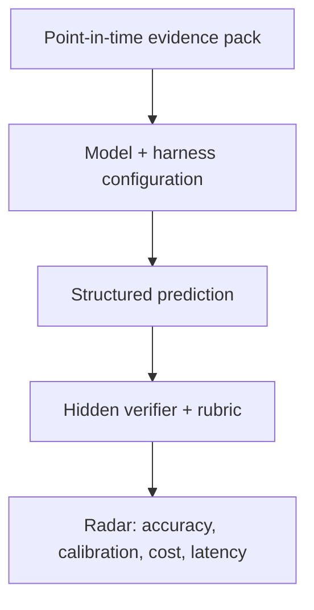

# FinAgentBench

FinAgentBench is an open benchmark for measuring whether an **agentic LLM +
harness** can make disciplined financial predictions from point-in-time
evidence.

The benchmark is designed for questions where the hard part is not recalling a
formula. The agent must reject false premises, connect accounting and business
facts through a causal chain, identify missing evidence, and express an
appropriately calibrated prediction.

> Example: “A company has a lot of goodwill, so its future depreciation will be
> high.” A strong agent should reject the premise: goodwill is generally not
> depreciated. The economically relevant risk is a future **impairment**, and a
> high goodwill balance alone is not enough to predict one.

## What is measured

The experimental unit is a complete configuration, not a model name:

`model × reasoning effort × harness × tools × evidence snapshot`

Each case tests five observable abilities:

1. **Premise checking** — catch incorrect accounting, causal, or temporal
   assumptions before predicting.
2. **Evidence-grounded causality** — connect disclosed facts to the target
   outcome without inventing intermediate facts.
3. **Point-in-time discipline** — use only information available at the stated
   as-of date.
4. **Uncertainty calibration** — separate directional risk from a claim that an
   event is certain.
5. **Decision usefulness** — return a concise, structured conclusion that can
   be scored and audited.

FinAgentBench asks for structured conclusions and short justifications. It does
not require or collect a model's private chain of thought.



## Quick start

Requires Python 3.11+ and [uv](https://docs.astral.sh/uv/).

```bash
uv sync --dev
uv run finagentbench validate
uv run finagentbench list
uv run finagentbench render goodwill-impairment-risk
uv run finagentbench a-share validate
uv run finagentbench a-share list
uv run pytest tests
```

The repository contains 12 fully inspectable synthetic cases spanning
accounting, cash flow, inventory, banking, fixed income, capital allocation,
liquidity, commodities and FX, insurance, credit covenants, equity income, and
operating leverage. Their role is to exercise the contract and runner, not to
provide a contamination-resistant leaderboard score.

Run the same cases through current locally available Codex models:

```bash
uv run finagentbench benchmark \
  --model gpt-5.6-sol \
  --model gpt-5.6-terra \
  --model gpt-5.6-luna \
  --reasoning-effort low \
  --workers 3 \
  --output results/codex-low.json \
  --report-output results/codex-low.md
```

This command uses the signed-in local Codex account and consumes its usage. Each
case gets an independent ephemeral session, a read-only sandbox, no external
data, and a JSON Schema-constrained final answer.

## Case contract

A case is a JSON evidence packet with:

- a stable ID, as-of date, and prediction horizon;
- a financial question and only the evidence visible to the agent;
- a machine-readable response contract;
- a weighted semantic rubric and public smoke-test answer key.

Public examples may include their rubrics. Formal benchmark cases should keep
labels and rubrics in the verifier so agents cannot read the answer from the
task repository.

Run a custom case directory without changing application code:

```bash
uv run finagentbench validate --cases-dir /path/to/cases
uv run finagentbench render CASE_ID --cases-dir /path/to/cases
```

## Public contract score

The deterministic smoke score totals 100 points:

- prediction class: 40;
- premise assessment: 25;
- causal evidence selection F1: 25;
- confidence calibration: 10.

The model sees neither the answer key nor the rubric. The case and suite hashes
in every run bind results to the exact evidence, labels, and scoring version.
Free-text explanations remain available for semantic or human review; the
deterministic score does not pretend to grade private reasoning.

## Real A-share walk-forward slice

Version 0.3 added six real 2019Q3 A-share scenarios: three companies that later
recorded material asset impairment and three matched high-goodwill companies
that did not cross the same threshold. The cases are deliberately balanced so
that “high goodwill means impairment” is not a winning shortcut.

Version 0.4 adds the first business-decision-quality case. Starting from 海光信息
on 2022-08-11, an agent must decide whether the company's unusually intensive
pre-listing R&D and CPU/DCU product roadmap will receive later commercial
validation. The predeclared FY2024 outcome requires all three of: at least 30%
revenue CAGR from 2021, at least 50% gross margin, and positive operating cash
flow. This measures later validation under an auditable rule; it does not claim
that R&D alone caused the outcome and it does not score stock return.

```bash
uv run finagentbench a-share render cn-a-2019q3-goodwill-002739
uv run finagentbench a-share search \
  cn-a-2019q3-goodwill-300467 '商誉 减值 狮之吼'
uv run finagentbench a-share score \
  cn-a-2019q3-goodwill-300467 /path/to/submission.json
uv run finagentbench a-share benchmark \
  --model gpt-5.6-sol --model gpt-5.6-terra \
  --workers 2 --output results/a-share.json \
  --report-output results/a-share.md
```

Historical replay never uses today's unrestricted web. It searches a frozen
corpus of official disclosures published no later than the scenario's as-of
date. The future annual report and the RQData-derived realized outcome live in
a separate label file and never enter the agent payload or search corpus.

The primary prediction metric is a proper probability score (Brier loss), not
only threshold accuracy. Evidence citation F1 is secondary, and the short
analysis remains available for semantic review. See
[`docs/a-share-walk-forward.md`](docs/a-share-walk-forward.md) for the data
contract, leakage boundary, and path from public historical development cases
to sealed live-shadow evaluation.

### First real-data replay

The first frozen-search run used Codex CLI 0.146.0, low reasoning effort, one
repeat, and independent sessions for all 18 model-scenario pairs. Every run
called the frozen search tool and completed successfully. Full answers and
probabilities are in
[`results/2026-08-12-a-share-frozen-web-low.json`](results/2026-08-12-a-share-frozen-web-low.json).

| Model | Composite | Brier loss | Log loss | Accuracy |
| --- | ---: | ---: | ---: | ---: |
| GPT-5.6 Terra | 94.32 | 0.0668 | 0.2816 | 100.0% |
| GPT-5.6 Sol | 92.74 | 0.0854 | 0.3328 | 100.0% |
| GPT-5.6 Luna | 90.75 | 0.1088 | 0.3737 | 83.3% |

Unlike the synthetic smoke suite, this slice separates the three configurations
on probability quality. Luna's one threshold error was a 0.56 event forecast
for the no-event 蓝色光标 case. Six public cases still cannot support a stable
model ranking or calibration claim; the result is evidence that the replay
contract works and that matched controls prevent a trivial always-event rule.

### First business-decision replay

The first 海光信息 replay used the same controlled frozen-search harness. All
three models cited the product roadmap, commercialization/ordering evidence,
and risk disclosures, and all predicted the realized event. Their probabilities
still differed materially:

| Model | Event probability | Brier loss | Searches |
| --- | ---: | ---: | ---: |
| GPT-5.6 Luna | 0.68 | 0.1024 | 4 |
| GPT-5.6 Terra | 0.60 | 0.1600 | 3 |
| GPT-5.6 Sol | 0.58 | 0.1764 | 7 |

Full outputs are in
[`results/2026-08-12-hygon-business-decision-frozen-web-low.json`](results/2026-08-12-hygon-business-decision-frozen-web-low.json).
One public case is not a ranking or calibration sample. Its value is showing
that the contract can test a joint operating outcome and that models identify
cash conversion, customer concentration, and supply-chain constraints instead
of treating high R&D as sufficient evidence.

## First measured baseline

The first controlled run used Codex CLI 0.146.0, low reasoning effort, one
repeat, and the same 12 public synthetic cases for all three models. Full model
answers and per-case scores are in
[`results/2026-08-12-codex-low.json`](results/2026-08-12-codex-low.json).

| Model | Score | Prediction accuracy | Premise accuracy | Evidence F1 |
| --- | ---: | ---: | ---: | ---: |
| GPT-5.6 Sol | 99.09 | 100.0% | 100.0% | 0.965 |
| GPT-5.6 Terra | 97.43 | 100.0% | 100.0% | 0.900 |
| GPT-5.6 Luna | 97.03 | 100.0% | 91.7% | 0.965 |

This is a harness smoke baseline, not a model ranking. All three models reached
100% prediction accuracy, revealing a ceiling effect. A defensible radar needs
harder sealed cases, repeated runs, real point-in-time evidence, and semantic
adjudication for cases where a categorical premise label hides an otherwise
correct explanation.

## Current scope

The repository now includes:

- 12 synthetic, point-in-time case packets with irrelevant evidence distractors;
- seven real A-share walk-forward scenarios with frozen official-search corpora,
  including six matched impairment cases and one business-decision case;
- case validation, rubric-free prompt rendering, and deterministic scoring;
- a controlled Codex CLI matrix runner with raw answer and token capture;
- reproducible case-suite hashes, Markdown reports, focused tests, and CI.

The intended next layers are runner adapters for multiple agent harnesses, a
server-side verifier for sealed cases, and a public radar that compares
accuracy, calibration, cost, latency, and stability over time. Distributed task
claims and community leaderboards belong in that service layer, not in the case
format.

## Design principles

- **Predictions, not trivia.** Cases should end in a future-facing judgment or
  decision under uncertainty.
- **No hindsight leakage.** Evidence must be frozen at the case's as-of date.
- **Causal traps are explicit.** A benchmark should reward agents that challenge
  a bad premise instead of confidently extending it.
- **Configuration is part of the result.** A score without the harness, tools,
  effort, runtime, and evidence version is not reproducible.
- **Scoring remains auditable.** Deterministic checks should cover hard
  invariants; domain rubrics and human review should govern genuinely semantic
  judgments.
- **Finance is jurisdiction-sensitive.** Accounting rules and market conventions
  must be stated in the evidence packet rather than assumed globally.

## Status

FinAgentBench is pre-alpha. The public synthetic suite is useful for authoring
and harness verification but is intentionally not presented as a frontier-model
leaderboard.

## License

[MIT](LICENSE)
