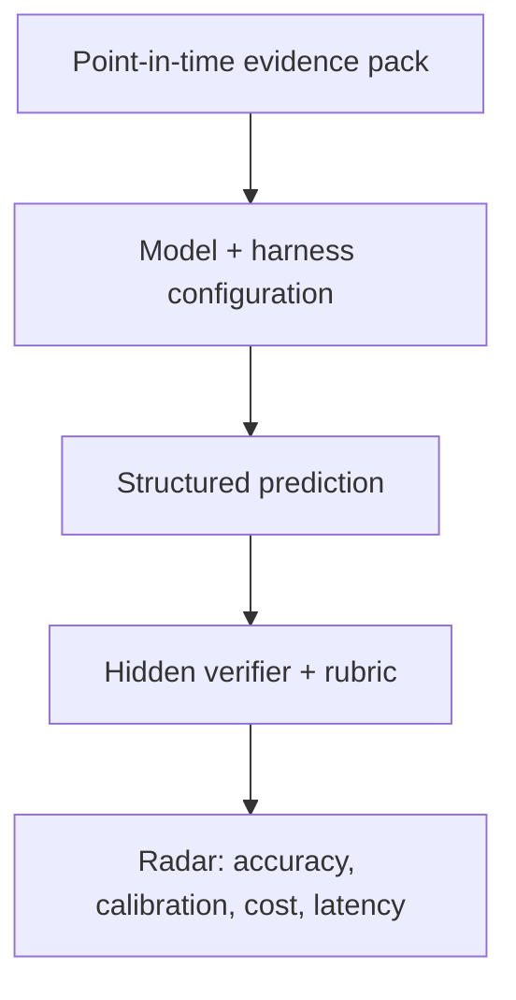

# FinAgentBench

FinAgentBench is an open benchmark for measuring whether an **agentic LLM +
harness** can make disciplined financial predictions from point-in-time
evidence.

The benchmark is designed for questions where the hard part is not recalling a
formula. The agent must reject false premises, connect accounting and business
facts through a causal chain, identify missing evidence, and express an
appropriately calibrated prediction.

> Example: “A company has a lot of goodwill, so its future depreciation will be
> high.” A strong agent should reject the premise: goodwill is generally not
> depreciated. The economically relevant risk is a future **impairment**, and a
> high goodwill balance alone is not enough to predict one.

## What is measured

The experimental unit is a complete configuration, not a model name:

`model × reasoning effort × harness × tools × evidence snapshot`

Each case tests five observable abilities:

1. **Premise checking** — catch incorrect accounting, causal, or temporal
   assumptions before predicting.
2. **Evidence-grounded causality** — connect disclosed facts to the target
   outcome without inventing intermediate facts.
3. **Point-in-time discipline** — use only information available at the stated
   as-of date.
4. **Uncertainty calibration** — separate directional risk from a claim that an
   event is certain.
5. **Decision usefulness** — return a concise, structured conclusion that can
   be scored and audited.

FinAgentBench asks for structured conclusions and short justifications. It does
not require or collect a model's private chain of thought.



## Quick start

Requires Python 3.11+ and [uv](https://docs.astral.sh/uv/).

```bash
uv sync --dev
uv run finagentbench validate
uv run finagentbench list
uv run finagentbench render goodwill-impairment-risk
uv run pytest tests
```

The repository contains 12 fully inspectable synthetic cases spanning
accounting, cash flow, inventory, banking, fixed income, capital allocation,
liquidity, commodities and FX, insurance, credit covenants, equity income, and
operating leverage. Their role is to exercise the contract and runner, not to
provide a contamination-resistant leaderboard score.

Run the same cases through current locally available Codex models:

```bash
uv run finagentbench benchmark \
  --model gpt-5.6-sol \
  --model gpt-5.6-terra \
  --model gpt-5.6-luna \
  --reasoning-effort low \
  --workers 3 \
  --output results/codex-low.json \
  --report-output results/codex-low.md
```

This command uses the signed-in local Codex account and consumes its usage. Each
case gets an independent ephemeral session, a read-only sandbox, no external
data, and a JSON Schema-constrained final answer.

## Case contract

A case is a JSON evidence packet with:

- a stable ID, as-of date, and prediction horizon;
- a financial question and only the evidence visible to the agent;
- a machine-readable response contract;
- a weighted semantic rubric and public smoke-test answer key.

Public examples may include their rubrics. Formal benchmark cases should keep
labels and rubrics in the verifier so agents cannot read the answer from the
task repository.

Run a custom case directory without changing application code:

```bash
uv run finagentbench validate --cases-dir /path/to/cases
uv run finagentbench render CASE_ID --cases-dir /path/to/cases
```

## Public contract score

The deterministic smoke score totals 100 points:

- prediction class: 40;
- premise assessment: 25;
- causal evidence selection F1: 25;
- confidence calibration: 10.

The model sees neither the answer key nor the rubric. The case and suite hashes
in every run bind results to the exact evidence, labels, and scoring version.
Free-text explanations remain available for semantic or human review; the
deterministic score does not pretend to grade private reasoning.

## First measured baseline

The first controlled run used Codex CLI 0.146.0, low reasoning effort, one
repeat, and the same 12 public synthetic cases for all three models. Full model
answers and per-case scores are in
[`results/2026-08-12-codex-low.json`](results/2026-08-12-codex-low.json).

| Model | Score | Prediction accuracy | Premise accuracy | Evidence F1 |
| --- | ---: | ---: | ---: | ---: |
| GPT-5.6 Sol | 99.09 | 100.0% | 100.0% | 0.965 |
| GPT-5.6 Terra | 97.43 | 100.0% | 100.0% | 0.900 |
| GPT-5.6 Luna | 97.03 | 100.0% | 91.7% | 0.965 |

This is a harness smoke baseline, not a model ranking. All three models reached
100% prediction accuracy, revealing a ceiling effect. A defensible radar needs
harder sealed cases, repeated runs, real point-in-time evidence, and semantic
adjudication for cases where a categorical premise label hides an otherwise
correct explanation.

## Current scope

The repository now includes:

- 12 synthetic, point-in-time case packets with irrelevant evidence distractors;
- case validation, rubric-free prompt rendering, and deterministic scoring;
- a controlled Codex CLI matrix runner with raw answer and token capture;
- reproducible case-suite hashes, Markdown reports, focused tests, and CI.

The intended next layers are runner adapters for multiple agent harnesses, a
server-side verifier for sealed cases, and a public radar that compares
accuracy, calibration, cost, latency, and stability over time. Distributed task
claims and community leaderboards belong in that service layer, not in the case
format.

## Design principles

- **Predictions, not trivia.** Cases should end in a future-facing judgment or
  decision under uncertainty.
- **No hindsight leakage.** Evidence must be frozen at the case's as-of date.
- **Causal traps are explicit.** A benchmark should reward agents that challenge
  a bad premise instead of confidently extending it.
- **Configuration is part of the result.** A score without the harness, tools,
  effort, runtime, and evidence version is not reproducible.
- **Scoring remains auditable.** Deterministic checks should cover hard
  invariants; domain rubrics and human review should govern genuinely semantic
  judgments.
- **Finance is jurisdiction-sensitive.** Accounting rules and market conventions
  must be stated in the evidence packet rather than assumed globally.

## Status

FinAgentBench is pre-alpha. The public synthetic suite is useful for authoring
and harness verification but is intentionally not presented as a frontier-model
leaderboard.

## License

[MIT](LICENSE)
