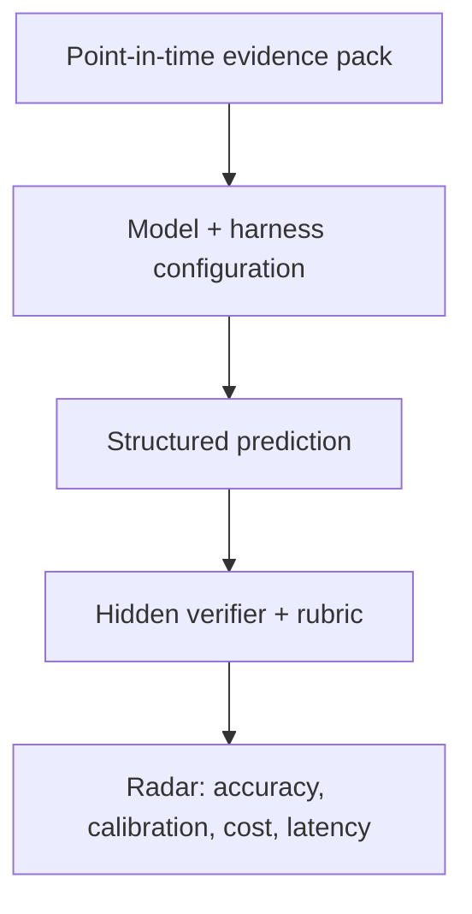

# FinAgentBench

FinAgentBench is an open benchmark for measuring whether an **agentic LLM +
harness** can make disciplined financial predictions from point-in-time
evidence.

The benchmark is designed for questions where the hard part is not recalling a
formula. The agent must reject false premises, connect accounting and business
facts through a causal chain, identify missing evidence, and express an
appropriately calibrated prediction.

**[Open the public A-share reasoning radar →](https://glacieralgo.github.io/FinAgentBench/)**

The radar currently presents 22 real A-share historical replays and 66 model
attempts as development diagnostics. It explicitly keeps the formal sealed
leaderboard empty until a pre-registered future cohort has matured.

> Example: “A company has a lot of goodwill, so its future depreciation will be
> high.” A strong agent should reject the premise: goodwill is generally not
> depreciated. The economically relevant risk is a future **impairment**, and a
> high goodwill balance alone is not enough to predict one.

## What is measured

The experimental unit is a complete configuration, not a model name:

`model × reasoning effort × harness × tools × evidence snapshot`

Each case tests five observable abilities:

1. **Premise checking** — catch incorrect accounting, causal, or temporal
   assumptions before predicting.
2. **Evidence-grounded causality** — connect disclosed facts to the target
   outcome without inventing intermediate facts.
3. **Point-in-time discipline** — use only information available at the stated
   as-of date.
4. **Uncertainty calibration** — separate directional risk from a claim that an
   event is certain.
5. **Decision usefulness** — return a concise, structured conclusion that can
   be scored and audited.

FinAgentBench asks for structured conclusions and short justifications. It does
not require or collect a model's private chain of thought.



## Quick start

Requires Python 3.11+ and [uv](https://docs.astral.sh/uv/).

```bash
uv sync --dev
uv run finagentbench validate
uv run finagentbench list
uv run finagentbench render goodwill-impairment-risk
uv run finagentbench a-share validate
uv run finagentbench a-share list
uv run finagentbench radar build
uv run finagentbench shadow --help
uv run pytest tests
```

The repository contains 12 fully inspectable synthetic cases spanning
accounting, cash flow, inventory, banking, fixed income, capital allocation,
liquidity, commodities and FX, insurance, credit covenants, equity income, and
operating leverage. Their role is to exercise the contract and runner, not to
provide a contamination-resistant leaderboard score.

Run the same cases through current locally available Codex models:

```bash
uv run finagentbench benchmark \
  --model gpt-5.6-sol \
  --model gpt-5.6-terra \
  --model gpt-5.6-luna \
  --reasoning-effort low \
  --workers 3 \
  --output results/codex-low.json \
  --report-output results/codex-low.md
```

This command uses the signed-in local Codex account and consumes its usage. Each
case gets an independent ephemeral session, a read-only sandbox, no external
data, and a JSON Schema-constrained final answer.

Version 0.8 adds the provider-neutral `finagentbench-stdio-v1` harness contract.

Version 0.10 adds a dependency-free public radar generated from committed result
artifacts. It compares Brier loss across models, task suites and nine financial
logic families; exposes per-case event probabilities; and keeps experiment
identity and coverage visible beside the plots. Open `radar/index.html` directly
or rebuild `radar/data.js` with `finagentbench radar build`.
An external adapter receives only the outcome-free prompt and schema, then
returns a structured submission, usage, tool counts, and compact event metadata.
Its manifest hash, runtime version, sandbox, external-data policy, session
persistence, and reasoning-effort mapping become part of the result identity.
The included OpenCode reference adapter can run any authenticated OpenCode
provider/model while denying all tools except the frozen A-share search command.

```bash
opencode providers login
uv run finagentbench a-share benchmark \
  --adapter-manifest examples/adapters/opencode.json \
  --model provider/model-id \
  --scenario-id cn-a-2020-cambricon-rd-commercial-validation \
  --output results/opencode-a-share.json
```

See [`docs/harness-adapters.md`](docs/harness-adapters.md) for the protocol,
security boundary, manifest schema, and reasoning-variant rules.

## Case contract

A case is a JSON evidence packet with:

- a stable ID, as-of date, and prediction horizon;
- a financial question and only the evidence visible to the agent;
- a machine-readable response contract;
- a weighted semantic rubric and public smoke-test answer key.

Public examples may include their rubrics. Formal benchmark cases should keep
labels and rubrics in the verifier so agents cannot read the answer from the
task repository.

Run a custom case directory without changing application code:

```bash
uv run finagentbench validate --cases-dir /path/to/cases
uv run finagentbench render CASE_ID --cases-dir /path/to/cases
```

## Public contract score

The deterministic smoke score totals 100 points:

- prediction class: 40;
- premise assessment: 25;
- causal evidence selection F1: 25;
- confidence calibration: 10.

The model sees neither the answer key nor the rubric. The case and suite hashes
in every run bind results to the exact evidence, labels, and scoring version.
Free-text explanations remain available for semantic or human review; the
deterministic score does not pretend to grade private reasoning.

## Real A-share walk-forward slice

Version 0.3 added six real 2019Q3 A-share scenarios: three companies that later
recorded material asset impairment and three matched high-goodwill companies
that did not cross the same threshold. The cases are deliberately balanced so
that “high goodwill means impairment” is not a winning shortcut.

Version 0.4 adds the first business-decision-quality case. Starting from 海光信息
on 2022-08-11, an agent must decide whether the company's unusually intensive
pre-listing R&D and CPU/DCU product roadmap will receive later commercial
validation. The predeclared FY2024 outcome requires all three of: at least 30%
revenue CAGR from 2021, at least 50% gross margin, and positive operating cash
flow. This measures later validation under an auditable rule; it does not claim
that R&D alone caused the outcome and it does not score stock return.

Version 0.6 adds twelve real scenarios as six matched event/control pairs. They
cover new ST or *ST treatment, modified audit opinions, incremental credit
impairment, inventory write-downs, acquisition performance-commitment
shortfalls, and controller changes following high equity-pledge risk. Each
family uses a predeclared observable target rather than scoring a vague notion
of distress. The audit target distinguishes a modified opinion from an
unmodified opinion containing an emphasis or going-concern paragraph; the
pledge target observes a later controller change without claiming that the
pledge alone caused it.

Version 0.7 turns the first business-decision case into two matched pairs.
寒武纪 is the no-event R&D control for 海光信息 under the same growth, margin,
and cash-conversion logic. 宁德时代's 湖西 expansion and 德方纳米's announced
磷酸铁锂前驱体 project form a factory-allocation event/control pair. The factory
contract requires a disclosed construction milestone, at least 20% revenue
CAGR, at least 10% gross margin, positive operating cash flow, and at least 75%
capacity utilization. These are later commercial-validation tests, not claims
that one project caused the company-wide result or proofs of counterfactual
optimality.

```bash
uv run finagentbench a-share render cn-a-2019q3-goodwill-002739
uv run finagentbench a-share search \
  cn-a-2019q3-goodwill-300467 '商誉 减值 狮之吼'
uv run finagentbench a-share score \
  cn-a-2019q3-goodwill-300467 /path/to/submission.json
uv run finagentbench a-share benchmark \
  --model gpt-5.6-sol --model gpt-5.6-terra \
  --workers 2 --output results/a-share.json \
  --report-output results/a-share.md
```

Historical replay never uses today's unrestricted web. It searches a frozen
corpus of official disclosures published no later than the scenario's as-of
date. The future annual report and the RQData-derived realized outcome live in
a separate label file and never enter the agent payload or search corpus.

All PDF-to-text authoring for the new slice uses the Rust CLI from
[`run-llama/liteparse`](https://github.com/run-llama/liteparse), pinned in case
provenance to version 2.11.1 and git revision
`53e4fc813d35f76d0169923d2c451b3c8700edb0`. Native PDFium extraction is used
when a text layer exists; scanned official reports use LiteParse's Tesseract OCR
path with Chinese and English language data. The parser is an authoring aid;
official signed filings and recomputable RQData values remain the evidence and
label authority.

The primary prediction metric is a proper probability score (Brier loss), not
only threshold accuracy. Evidence citation F1 is secondary, and the short
analysis remains available for semantic review. See
[`docs/a-share-walk-forward.md`](docs/a-share-walk-forward.md) for the data
contract, leakage boundary, and path from public historical development cases
to sealed live-shadow evaluation.

### First real-data replay

The first frozen-search run used Codex CLI 0.146.0, low reasoning effort, one
repeat, and independent sessions for all 18 model-scenario pairs. Every run
called the frozen search tool and completed successfully. Full answers and
probabilities are in
[`results/2026-08-12-a-share-frozen-web-low.json`](results/2026-08-12-a-share-frozen-web-low.json).

| Model | Composite | Brier loss | Log loss | Accuracy |
| --- | ---: | ---: | ---: | ---: |
| GPT-5.6 Terra | 94.32 | 0.0668 | 0.2816 | 100.0% |
| GPT-5.6 Sol | 92.74 | 0.0854 | 0.3328 | 100.0% |
| GPT-5.6 Luna | 90.75 | 0.1088 | 0.3737 | 83.3% |

Unlike the synthetic smoke suite, this slice separates the three configurations
on probability quality. Luna's one threshold error was a 0.56 event forecast
for the no-event 蓝色光标 case. Six public cases still cannot support a stable
model ranking or calibration claim; the result is evidence that the replay
contract works and that matched controls prevent a trivial always-event rule.

### Matched trap-family replay

The version 0.6 replay ran all twelve new scenarios through the same three
models, one isolated low-effort session per model and scenario. All 36 sessions
used frozen search and completed successfully.

| Model | Composite | Brier loss | Log loss | Accuracy |
| --- | ---: | ---: | ---: | ---: |
| GPT-5.6 Sol | 85.79 | 0.1672 | 0.5073 | 83.3% |
| GPT-5.6 Luna | 84.11 | 0.1870 | 0.5608 | 75.0% |
| GPT-5.6 Terra | 78.25 | 0.2558 | 0.6945 | 50.0% |

This slice no longer has the synthetic suite's ceiling effect. Across the 18
model-family comparisons, the event case received a strictly higher
probability than its matched control in 14. The same-company 2022/2023 audit
pair was particularly hard: Sol and Luna assigned more risk to the no-event
2022 control, while Terra separated it by only two probability points. All
three models also overestimated ST-transition risk for the no-event 银宝山新
control. These are development diagnostics, not a stable model ranking: each
configuration still has only one run per public case.

Full answers, searches, per-case probabilities, and scores are in
[`results/2026-08-12-a-share-traps-frozen-web-low.json`](results/2026-08-12-a-share-traps-frozen-web-low.json),
with a compact report in
[`results/2026-08-12-a-share-traps-frozen-web-low.md`](results/2026-08-12-a-share-traps-frozen-web-low.md).

### First business-decision replay

The first 海光信息 replay used the same controlled frozen-search harness. All
three models cited the product roadmap, commercialization/ordering evidence,
and risk disclosures, and all predicted the realized event. Their probabilities
still differed materially:

| Model | Event probability | Brier loss | Searches |
| --- | ---: | ---: | ---: |
| GPT-5.6 Luna | 0.68 | 0.1024 | 4 |
| GPT-5.6 Terra | 0.60 | 0.1600 | 3 |
| GPT-5.6 Sol | 0.58 | 0.1764 | 7 |

Full outputs are in
[`results/2026-08-12-hygon-business-decision-frozen-web-low.json`](results/2026-08-12-hygon-business-decision-frozen-web-low.json).
One public case is not a ranking or calibration sample. Its value is showing
that the contract can test a joint operating outcome and that models identify
cash conversion, customer concentration, and supply-chain constraints instead
of treating high R&D as sufficient evidence.

### Matched business-decision replay

Version 0.7 reran the complete four-case decision suite as twelve independent
sessions. Every session used frozen search and completed. All three models
correctly placed 海光信息 above 寒武纪 and 宁德时代 above 德方纳米, and all twelve
thresholded predictions matched the labels.

| Model | Brier loss | Log loss | Accuracy | Mean searches |
| --- | ---: | ---: | ---: | ---: |
| GPT-5.6 Luna | 0.0792 | 0.3293 | 100.0% | 3.50 |
| GPT-5.6 Sol | 0.1187 | 0.4065 | 100.0% | 5.25 |
| GPT-5.6 Terra | 0.1308 | 0.4459 | 100.0% | 1.75 |

The paired probability gaps were positive for every model: 0.31-0.44 for the
R&D pair and 0.26-0.44 for the factory pair. This is still only four public
cases with one repeat, so the ordering is a harness diagnostic rather than a
model ranking. Full answers and tool counts are in
[`results/2026-08-12-business-decisions-frozen-web-low.json`](results/2026-08-12-business-decisions-frozen-web-low.json),
with the compact report in
[`results/2026-08-12-business-decisions-frozen-web-low.md`](results/2026-08-12-business-decisions-frozen-web-low.md).

## Live-shadow sealing

Version 0.5 makes the future-generalization layer executable. A live-shadow
scenario may run with native real-Web search only on its declared `as_of` date.
Every outcome-free scenario byte, model answer, complete tool event trace and
harness identity is bound into one SHA-256 commitment. The result must then be
published to an externally timestamped append-only surface before the outcome
exists. When the horizon matures, a separate official-source label is validated
and scored against the intact seal; the original prediction artifact is never
rewritten.

```bash
uv run finagentbench shadow run \
  src/finagentbench/live_shadow/scenarios/cn-a-live-20260812-hygon-rd-efficiency.json \
  --model gpt-5.6-terra --output results/live-shadow/hygon-seal.json
uv run finagentbench shadow verify results/live-shadow/hygon-seal.json
uv run finagentbench shadow resolve \
  results/live-shadow/hygon-seal.json /path/to/matured-label.json \
  --output results/live-shadow/hygon-resolution.json
```

The first unresolved seal was created on 2026-08-12 for 海光信息 FY2026 R&D
commercial efficiency. Terra used eight native Web searches and assigned 0.56
probability to the joint event: at least 25% revenue growth, at least 55% gross
margin, and at least 10% operating-cash-flow margin. Its commitment is
`3fc9b7588ac6879804dc2f901a790164c05fd5c55c70718a04b32d51c1aecbeb`.
There is deliberately no outcome score yet. See
[`docs/live-shadow.md`](docs/live-shadow.md) for the sealing and resolution
contract.

Version 0.9 adds pre-registered sealed hard-case cohorts. Before the first model
run, an author commits to at least six future cases across at least three
families, two models, and three repeats. The publishable plan commitment hides
the scenarios; later finalization requires one matching live-shadow seal per
slot and preserves failed attempts. This blocks post-answer case selection,
model-matrix changes, and best-repeat cherry-picking. The existing one-run 海光
seal remains a development example and is not retroactively leaderboard
eligible. See [`docs/sealed-suite.md`](docs/sealed-suite.md).

## First measured baseline

The first controlled run used Codex CLI 0.146.0, low reasoning effort, one
repeat, and the same 12 public synthetic cases for all three models. Full model
answers and per-case scores are in
[`results/2026-08-12-codex-low.json`](results/2026-08-12-codex-low.json).

| Model | Score | Prediction accuracy | Premise accuracy | Evidence F1 |
| --- | ---: | ---: | ---: | ---: |
| GPT-5.6 Sol | 99.09 | 100.0% | 100.0% | 0.965 |
| GPT-5.6 Terra | 97.43 | 100.0% | 100.0% | 0.900 |
| GPT-5.6 Luna | 97.03 | 100.0% | 91.7% | 0.965 |

This is a harness smoke baseline, not a model ranking. All three models reached
100% prediction accuracy, revealing a ceiling effect. A defensible radar needs
harder sealed cases, repeated runs, real point-in-time evidence, and semantic
adjudication for cases where a categorical premise label hides an otherwise
correct explanation.

## Current scope

The repository now includes:

- 12 synthetic, point-in-time case packets with irrelevant evidence distractors;
- 22 real A-share walk-forward scenarios with frozen official-search corpora:
  six matched goodwill/impairment cases, six additional matched trap families,
  and two matched business-decision families for R&D and factory allocation;
- a real-Web live-shadow runner with full-trace commitments and maturity-gated
  resolution;
- pre-registered hard-suite commitments that bind case families, model matrices,
  repetitions, and every resulting live-shadow seal;
- case validation, rubric-free prompt rendering, and deterministic scoring;
- controlled Codex CLI runners plus a provider-neutral stdio adapter contract
  and restricted OpenCode reference adapter;
- an offline-capable public radar with reproducible artifact hashes, family-level
  diagnostics, case filtering, and an explicit sealed-ranking eligibility gate;
- reproducible case-suite hashes, Markdown reports, focused tests, and CI.

The intended next layer is a server-side verifier for sealed cases. Once
pre-registered live-shadow cohorts mature, the radar can add stability, cost and
formal ranking without trusting client-reported scores. Distributed task claims
and community leaderboards belong in that service layer, not in the case format.

## Design principles

- **Predictions, not trivia.** Cases should end in a future-facing judgment or
  decision under uncertainty.
- **No hindsight leakage.** Evidence must be frozen at the case's as-of date.
- **Causal traps are explicit.** A benchmark should reward agents that challenge
  a bad premise instead of confidently extending it.
- **Configuration is part of the result.** A score without the harness, tools,
  effort, runtime, and evidence version is not reproducible.
- **Scoring remains auditable.** Deterministic checks should cover hard
  invariants; domain rubrics and human review should govern genuinely semantic
  judgments.
- **Finance is jurisdiction-sensitive.** Accounting rules and market conventions
  must be stated in the evidence packet rather than assumed globally.

## Status

FinAgentBench is pre-alpha. The public synthetic suite is useful for authoring
and harness verification but is intentionally not presented as a frontier-model
leaderboard.

## License

[MIT](LICENSE)
