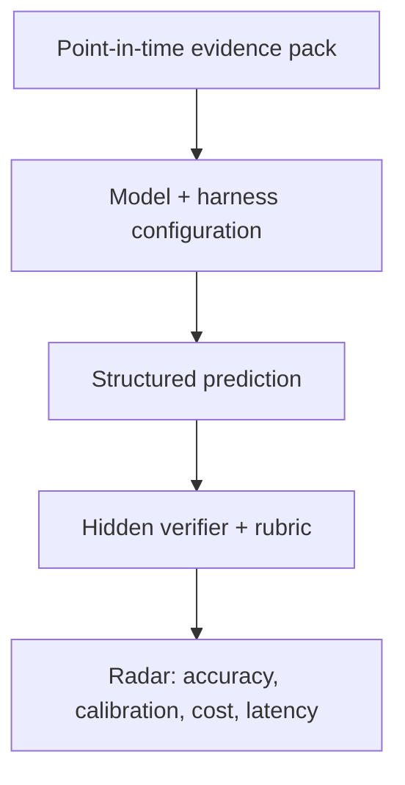

# FinAgentBench

FinAgentBench is an open benchmark for measuring whether an **agentic LLM +
harness** can make disciplined financial predictions from point-in-time
evidence.

The benchmark is designed for questions where the hard part is not recalling a
formula. The agent must reject false premises, connect accounting and business
facts through a causal chain, identify missing evidence, and express an
appropriately calibrated prediction.

> Example: “A company has a lot of goodwill, so its future depreciation will be
> high.” A strong agent should reject the premise: goodwill is generally not
> depreciated. The economically relevant risk is a future **impairment**, and a
> high goodwill balance alone is not enough to predict one.

## What is measured

The experimental unit is a complete configuration, not a model name:

`model × reasoning effort × harness × tools × evidence snapshot`

Each case tests five observable abilities:

1. **Premise checking** — catch incorrect accounting, causal, or temporal
   assumptions before predicting.
2. **Evidence-grounded causality** — connect disclosed facts to the target
   outcome without inventing intermediate facts.
3. **Point-in-time discipline** — use only information available at the stated
   as-of date.
4. **Uncertainty calibration** — separate directional risk from a claim that an
   event is certain.
5. **Decision usefulness** — return a concise, structured conclusion that can
   be scored and audited.

FinAgentBench asks for structured conclusions and short justifications. It does
not require or collect a model's private chain of thought.



## Quick start

Requires Python 3.11+ and [uv](https://docs.astral.sh/uv/).

```bash
uv sync --dev
uv run finagentbench validate
uv run finagentbench list
uv run finagentbench render goodwill-impairment-risk
uv run pytest tests/test_cases.py
```

The bundled public case is intentionally small and fully inspectable. Its role
is to demonstrate the case contract and evaluation philosophy, not to provide a
contamination-resistant leaderboard score.

## Case contract

A case is a JSON evidence packet with:

- a stable ID, as-of date, and prediction horizon;
- a financial question and only the evidence visible to the agent;
- a machine-readable response contract;
- a weighted evaluation rubric.

Public examples may include their rubrics. Formal benchmark cases should keep
labels and rubrics in the verifier so agents cannot read the answer from the
task repository.

Run a custom case directory without changing application code:

```bash
uv run finagentbench validate --cases-dir /path/to/cases
uv run finagentbench render CASE_ID --cases-dir /path/to/cases
```

## Initial scope

This repository starts with the narrow, auditable benchmark core:

- case schema and validation;
- prompt rendering that excludes the rubric;
- public reference cases;
- focused contract tests.

The intended next layers are runner adapters for multiple agent harnesses, a
server-side verifier for sealed cases, and a public radar that compares
accuracy, calibration, cost, latency, and stability over time. Distributed task
claims and community leaderboards belong in that service layer, not in the case
format.

## Design principles

- **Predictions, not trivia.** Cases should end in a future-facing judgment or
  decision under uncertainty.
- **No hindsight leakage.** Evidence must be frozen at the case's as-of date.
- **Causal traps are explicit.** A benchmark should reward agents that challenge
  a bad premise instead of confidently extending it.
- **Configuration is part of the result.** A score without the harness, tools,
  effort, runtime, and evidence version is not reproducible.
- **Scoring remains auditable.** Deterministic checks should cover hard
  invariants; domain rubrics and human review should govern genuinely semantic
  judgments.
- **Finance is jurisdiction-sensitive.** Accounting rules and market conventions
  must be stated in the evidence packet rather than assumed globally.

## Status

FinAgentBench is at the repository-foundation stage. The public case contract is
expected to evolve before the first stable benchmark release.

## License

[MIT](LICENSE)

