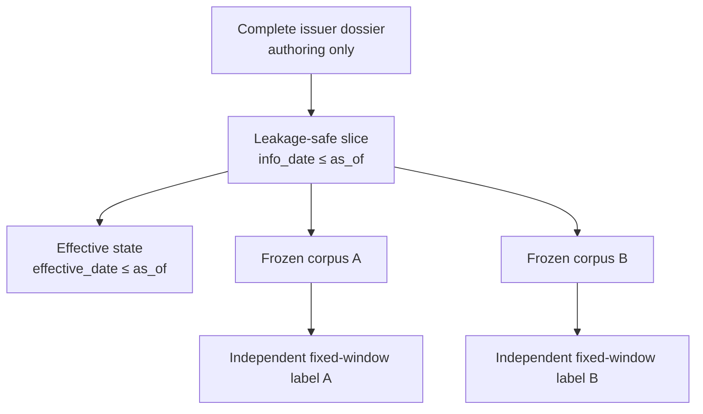

# Issuer dossiers

PITFALL stores a company as a stable security identity plus a dated event
timeline.  A changed short name, an ST prefix, or a new strategy announcement is
an event; none of them creates a new company and none is a label by itself.

The dossier is an authoring and audit artifact.  Scenario, corpus, and label
files remain the scoring authority.  A single issuer snapshot may support
several sibling questions, but every question must have its own literal target,
fixed outcome window, and independently recomputable label.

## Time contract

Every event has both `info_date` and `effective_date`:

- the event becomes visible when `info_date <= as_of`;
- it changes projected company state only when `effective_date <= as_of`;
- an announced future event is visible as a plan but is not applied early;
- sources published after an event's `info_date` are rejected;
- only sources referenced by visible events are included in an as-of slice.

This distinction matters for announced name changes, risk-warning decisions,
asset transactions, board changes, project schedules, and other actions whose
announcement and legal or operating effect occur on different dates.

## Operating domains

The stable domains are `identity`, `governance`, `financing`,
`capital_allocation`, `operations`, `commercial`, `working_capital`,
`cash_payment`, `reporting`, `regulatory`, `listing`, and `market`.  The
`event_type` within each domain is open and configuration-driven.

State-changing fields are deliberately objective: security name, controller,
board composition, project status, financing status, audit opinion, or exchange
risk-warning status.  Interpretive descriptions such as “bad management” are
not state fields or labels.

## Identity and controls

`order_book_id` is the stable issuer key.  Historical names must come from
point-in-time name-change records or official filings; current-name columns
that backfill history are not admissible identity evidence.

Name changes, strategic narratives, management continuity, controller
continuity, and prior ST episodes are matching features.  Case authoring should
seek counterexamples across at least these quadrants:

- rename plus failed operating validation;
- rename plus successful operating validation;
- stable name plus failure;
- stable name plus healthy operation;
- continuing management plus recurrence/no recurrence;
- changed management plus recurrence/no recurrence.

These controls prevent the benchmark from rewarding shortcuts such as “many
renames means failure”, “former ST means another ST”, or “low operating cash
flow means fraudulent growth”.

## Loading and digests

Use `load_dossier(path)` for one JSON file or `load_dossiers(directory)` for a
directory.  The directory loader rejects duplicate dossier IDs and duplicate
stable issuer identities.  `dossier_digest()` produces a canonical SHA-256
digest for either a complete dossier or an as-of slice.
