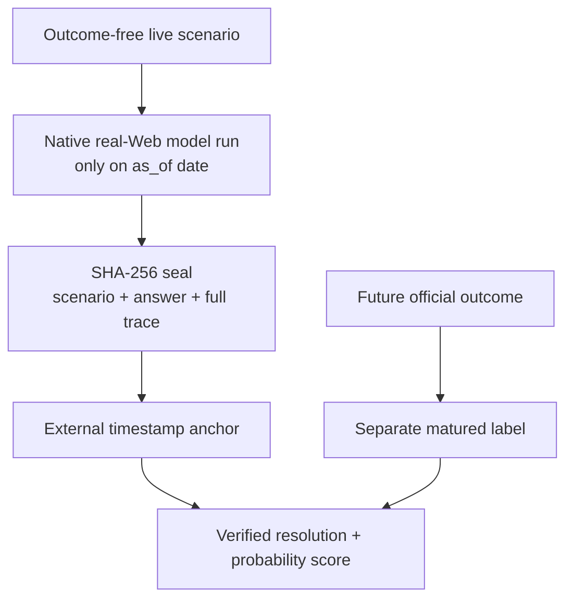

# Live-shadow sealing protocol

Historical frozen-Web cases are useful development tests, but public past
outcomes can eventually be memorized. Live shadow creates the prediction before
the target outcome exists and keeps the future label outside the run artifact.

## Lifecycle

1. Author an outcome-free `live_shadow` scenario with a future window and a
   predeclared numeric outcome rule.
2. On exactly the scenario's `as_of` date, run isolated model sessions with
   native real-Web search. Backdated live-Web replay is rejected because current
   search results can leak hindsight.
3. Validate that each completed model actually searched, returned a probability
   consistent with its binary decision, and cited only allowlisted direct URLs.
4. Seal the raw scenario, rubric-free agent payload, complete JSONL event traces,
   answers, model/harness identity and timestamps under one canonical SHA-256
   commitment.
5. Publish the artifact or digest to an externally timestamped append-only
   system. A hash binds bytes but does not independently prove when they existed.
6. After an official filing resolves the target, create a separate label with
   raw observations, recomputable derivations and official outcome sources.
7. `shadow resolve` verifies the original seal, rejects premature or inconsistent
   labels, calculates Brier/log loss and emits a new committed resolution
   artifact without modifying the seal.

## Current unresolved seal

`cn-a-live-20260812-hygon-rd-efficiency` asks whether 海光信息 FY2026 will
simultaneously deliver:

- revenue growth of at least 25%;
- gross margin of at least 55%;
- operating cash flow divided by revenue of at least 10%.

The rule tests commercial efficiency rather than asserting that R&D caused the
result. The outcome window ends on 2027-04-30. The 2026 annual report and its
first-publication RQData PIT rows may enter the future label only after they are
public.

The 2026-08-12 Terra prediction is event probability `0.56`, with eight native
Web searches. The sealed development artifact is
[`results/live-shadow/2026-08-12-hygon-rd-efficiency-seal.json`](../results/live-shadow/2026-08-12-hygon-rd-efficiency-seal.json),
committed as
`3fc9b7588ac6879804dc2f901a790164c05fd5c55c70718a04b32d51c1aecbeb`.

## Trust boundary

The public repository demonstrates deterministic binding, leak-resistant
ordering and maturity gates. A production leaderboard still needs a
server-owned append-only registry or trusted timestamp service so benchmark
authors cannot rewrite history by replacing Git refs. Outcome labels and formal
ranking remain verifier-owned. Multi-case leaderboard cohorts additionally use
the pre-registration and anti-cherry-picking contract in
[`sealed-suite.md`](sealed-suite.md).
