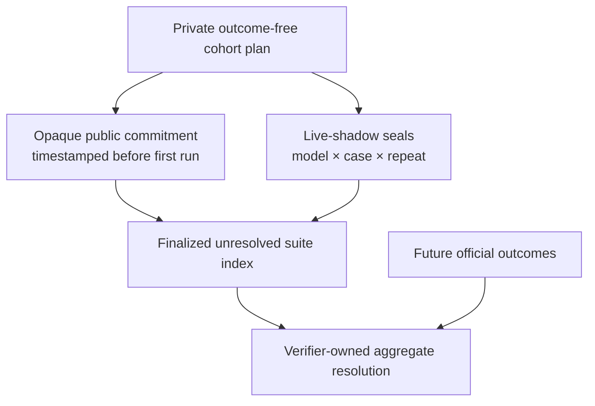

# Sealed hard-case suite

A single live-shadow prediction prevents hindsight leakage, but it does not
prevent benchmark authors from publishing only favorable cases or choosing the
best repeat after seeing model answers. A sealed suite pre-registers the cohort
and complete experiment matrix before the first run.

## Hard-suite admission rules

Version 1 deliberately sets a non-trivial floor:

- at least 6 unresolved live-shadow cases;
- at least 3 decision families;
- at least 2 cases in every included family;
- at least 2 model IDs;
- at least 3 independent repeats per model and case;
- at least one observable live-Web search in every completed attempt;
- mean Brier loss as the primary metric.

Failed attempts remain in the cohort. They cannot be deleted and rerun under
the same suite identity. Classification accuracy, log loss, evidence quality,
latency, cost, and failure rate are diagnostics; none replaces the proper
probability score.

## Two-stage pre-registration

The source plan contains outcome-free scenarios and therefore remains private
until every model run is sealed. `suite preregister` creates two artifacts:

1. a private plan containing the exact scenarios, scenario hashes, case-family
   assignments, model matrix, effort contract, repetitions, and search minimum;
2. a public opaque commitment containing the plan digest, policy digest, family
   counts, dates, and its own commitment—but no scenario IDs, prompts, targets,
   or securities.

Publish the opaque artifact or its digest to an externally timestamped,
append-only surface before the first model run. SHA-256 binds bytes; it does not
independently prove when those bytes existed.



## Source contract

The private source is JSON. Each `scenario` is a normal schema-v2
`live_shadow` scenario whose as-of date is today or in the future at
registration time.

```json
{
  "schema_version": 1,
  "suite_id": "a-share-shadow-hard-2026q4",
  "policy": {
    "required_models": ["model-a", "model-b"],
    "reasoning_effort": "low",
    "repeats": 3,
    "required_web_search_calls": 1,
    "minimum_case_count": 6,
    "minimum_family_count": 3,
    "minimum_cases_per_family": 2,
    "primary_metric": "mean_brier_loss"
  },
  "cases": [
    {
      "slot_id": "rd-01",
      "family": "rd-commercial-validation",
      "scenario": {}
    }
  ]
}
```

The abbreviated example needs at least five more populated cases before it will
validate.

## Commands

Pre-register and publish only the opaque output:

```bash
uv run finagentbench suite preregister private-source.json \
  --plan-output private-plan.json \
  --commitment-output public-plan-commitment.json
uv run finagentbench suite verify public-plan-commitment.json
```

Run each private scenario on exactly its as-of date with the predeclared matrix:

```bash
uv run finagentbench shadow run scenario.json \
  --model model-a --model model-b \
  --reasoning-effort low --repeats 3 --workers 3 \
  --output seals/scenario-seal.json
```

After every slot has one intact seal, reveal the plan and finalize the cohort:

```bash
uv run finagentbench suite finalize \
  private-plan.json public-plan-commitment.json \
  --seal seals/rd-01.json \
  --seal seals/rd-02.json \
  --seal seals/factory-01.json \
  --seal seals/factory-02.json \
  --seal seals/cash-01.json \
  --seal seals/cash-02.json \
  --output sealed-suite.json
uv run finagentbench suite verify sealed-suite.json
```

Finalization checks exact scenario digests, one seal per slot, the model and
reasoning matrix, all repeat identities, minimum search use for completed runs,
and plan-before-run ordering. The suite index keeps both completed and failed
attempt counts. It remains unresolved until every member has a matured official
label and the verifier creates an aggregate resolution.

## Existing development seal

The 2026-08-12 海光信息 seal predates this cohort protocol and has one model run
with one repeat. It remains a valid individual live-shadow development artifact
but is not retroactively eligible for a sealed hard-case suite or formal radar
ranking.
